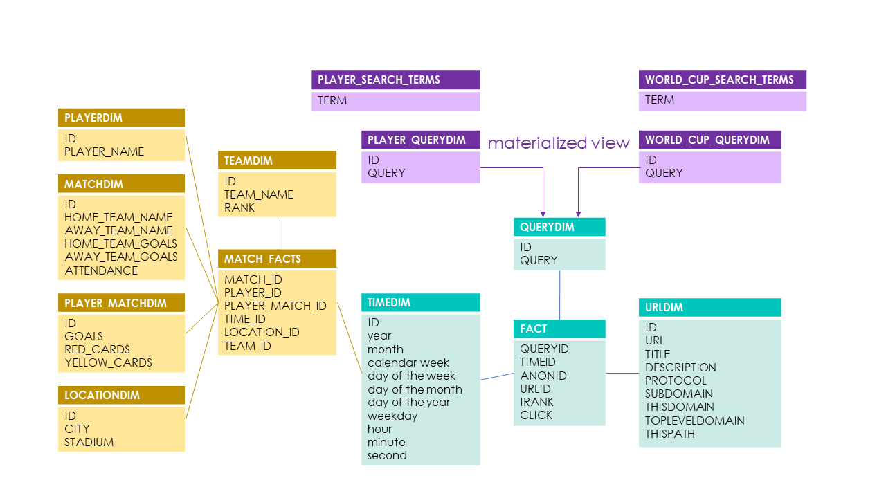

# wise_2324_bi_project
For the Project of BI Course during Winter Semester 2023-2024

## Setup
1. ```pip install -r "requirements.txt"```
2. start exasol
3. (not needed for standard connection) configure .pyexasol.ini with exasol connection data 
4. open ```jupyter notebook```
5. run the create_tables_import_data notebook

## ETL
### External Datasources
| Link | Name |
| - | - |
| [Kaggle](https://www.kaggle.com/datasets/iamsouravbanerjee/fifa-football-world-cup-dataset/data)  | Fifa World Cup 2006 Country Statistics | 
| [Kaggle](https://www.kaggle.com/datasets/abecklas/fifa-world-cup)  | Fifa World Cup Player Statistics | 
| [Github](https://github.com/mneedham/neo4j-worldcup/blob/master/data/import/matches.csv)  | Fifa World Cup Match Statistics |
| [Kaggle](https://www.kaggle.com/datasets/abecklas/fifa-world-cup)  | Fifa World Cup Match Statistics |

### Data Transformation
In our data transformation process, we first selected certain terms, which we then modified using various misspelling methods. We checked if these terms appeared in a query, if they did, we used that query. This is how we constructed our QUERY_DIMS.
<br>
Additionally, we cleaned external data in a Jupyter Notebook, removing/replacing missing characters and generating new columns from the given data. Furthermore, we built a large table with all IDs and attributes. The ID columns in this table formed our FACT Table. Afterward, we only needed to group by IDs to obtain the various dimensions.

### Load
After the data cleansing, we saved all cleaned tables as CSV files. This allowed us to use pyexasol in another Jupyter Notebook to load all CSVs into our database.


## Schema



## Queries
1. Are the cards that a player receives related to his goals?
2. Which stadium/team got the most goals?
3. How have the searches for the World Cup changed over time? Was there an increase over the months to the start?
4. What are the most searched queries (only world cup related, excluding worldcup)?
5. What are the most clicked search results for the World Cup and how frequently are they clicked?
6. Who are the most searched players, and how many goals did they score? Is a player's search popularity related to their goals?